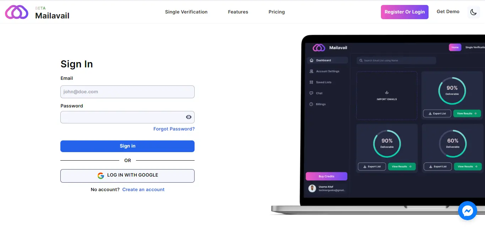
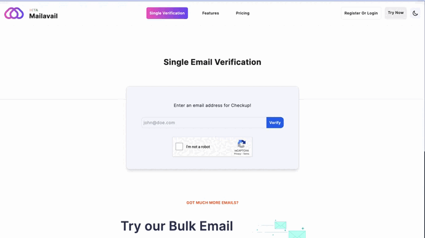
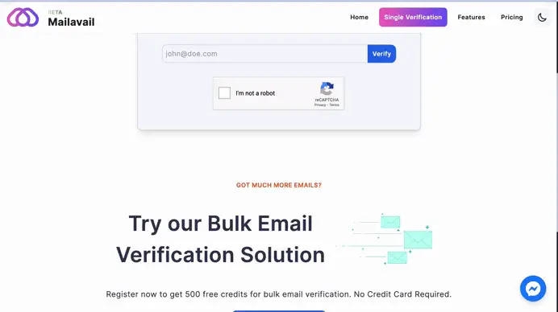
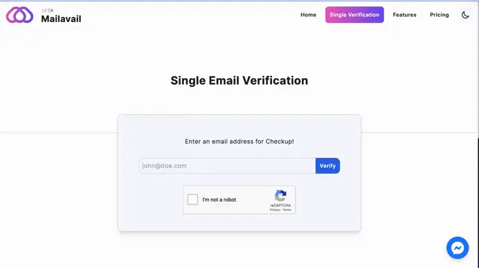

# How Do I Get Started

## Getting Started:

1. **Create Your Account:**
   Sign up for a MailAvail account to access our powerful email verification services. Choose from our flexible plans based on your unique needs.

   

2. **Single Email Verification:**
   Explore our step-by-step guide on how to verify a single email address using MailAvail. Ensure that each communication counts by confirming the accuracy of individual contacts.

   

3. **Bulk Email Verification:**
   For those with extensive email lists, our bulk verification guide walks you through the process of uploading and verifying large sets of email addresses efficiently.

   - **Paste Your Text Emails**

   

   - **Import your File**

   

4. **Interpreting Results:**
   Learn how to interpret the results of your verification process. Understand the different statuses and take action to clean and optimize your email lists.
