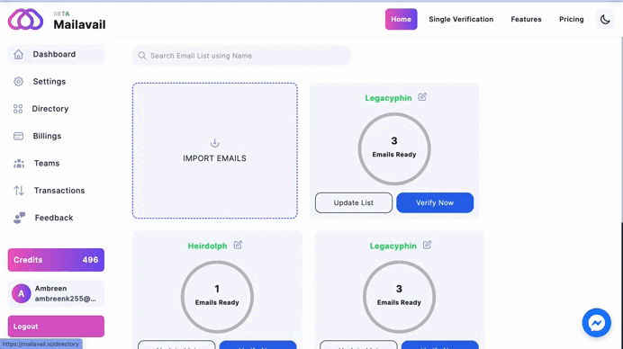

# How do i save list to a directory?

On the Dashboard, navigate to the modal housing your verified list of emails. Within this modal, find the '**Add to Directory**' button.

Upon clicking, a menu will appear, presenting various directory options. Choose the directory where you'd like to organize and store your list. This user-friendly feature empowers you to seamlessly manage your email data by categorizing it into specific directories of your choice.

Effortlessly streamline your email organization process with Mailavail's '**Add to Directory**' functionality. Tailor your email lists to specific categories for improved accessibility and a more organized dashboard experience.

