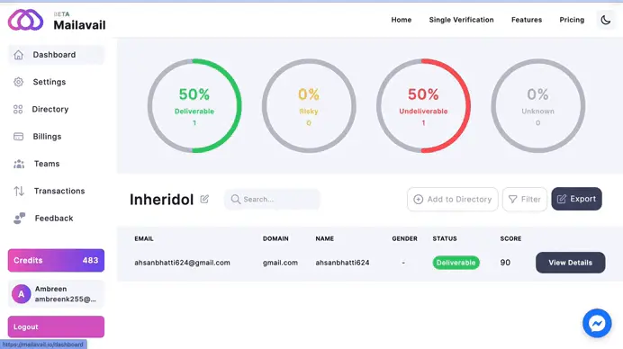

# How do I export only deliverable emails?

# View Results and Export Deliverable Emails

Clicking on the **View Results** button navigates you to the result page. Here, you have the option to filter only deliverable emails. Once you've filtered the results to display only deliverable emails, clicking on the 
**Export List** button presents you with options to select one of the given formats such as CSV, XLSX, or TXT for exporting your list.

This streamlined process enables you to quickly view and export the specific subset of deliverable emails in the format that best suits your needs.