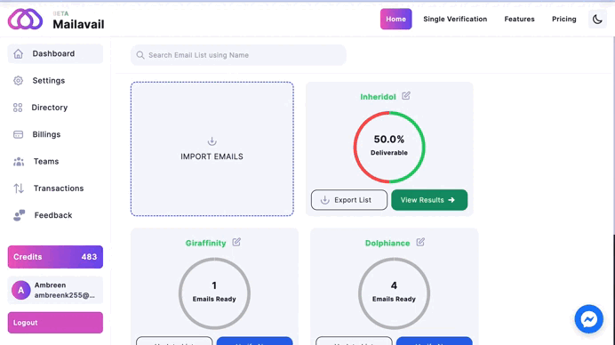

# How do I export my list?

# Email List Verification and Export
After completing the verification of your email list, follow these steps:

1. Click on the **Export List** button.
   This action will prompt a modal to appear, offering options to import your list in various formats, including CSV, XLSX, and TST.
2. Choose your preferred format.
3. Confirm the export.

Upon completing these steps, your file will be exported, providing you with a conveniently formatted and easily usable version of your verified email list.