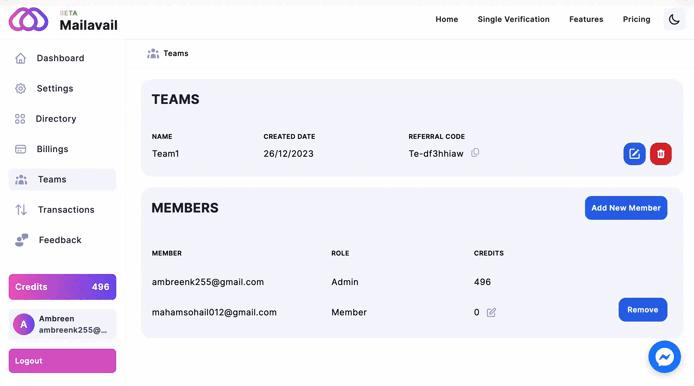

# If owner want to remove team members?

# Removing a Team Member

If the owner wishes to remove a team member, they can simply click on the "Remove" button. This straightforward process allows for efficient management of team members, providing the owner with the ability to make necessary adjustments as needed.

