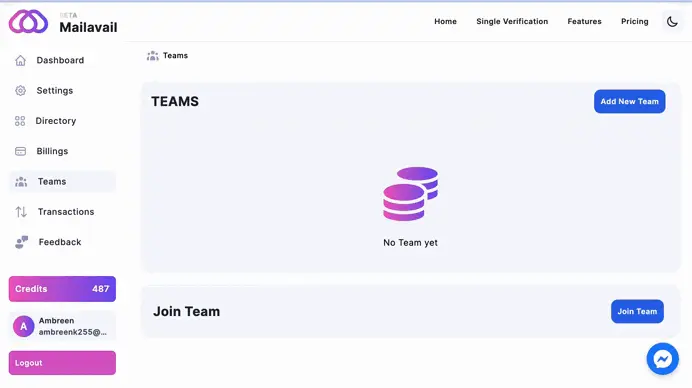

# If team member want to join group?

# Joining a Group with Referral Code

If a team member wishes to join a group, they can do so by using a referral code. Additionally, the admin has the capability to add a team member to a group directly. This dual approach provides flexibility for team members to join groups using referral codes or be added directly by the admin, ensuring a seamless and inclusive group membership process.

